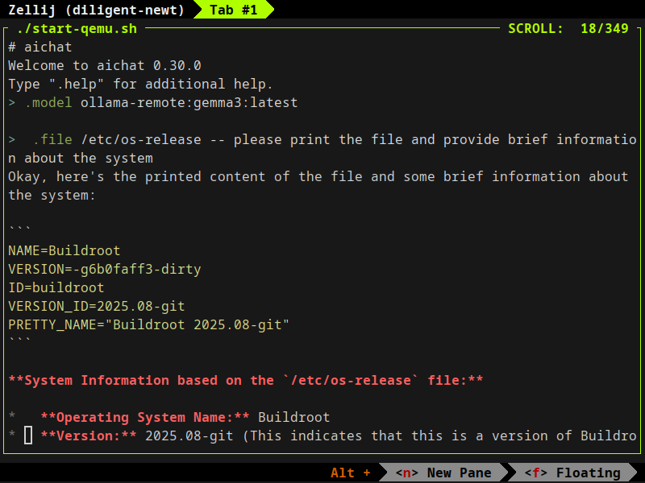
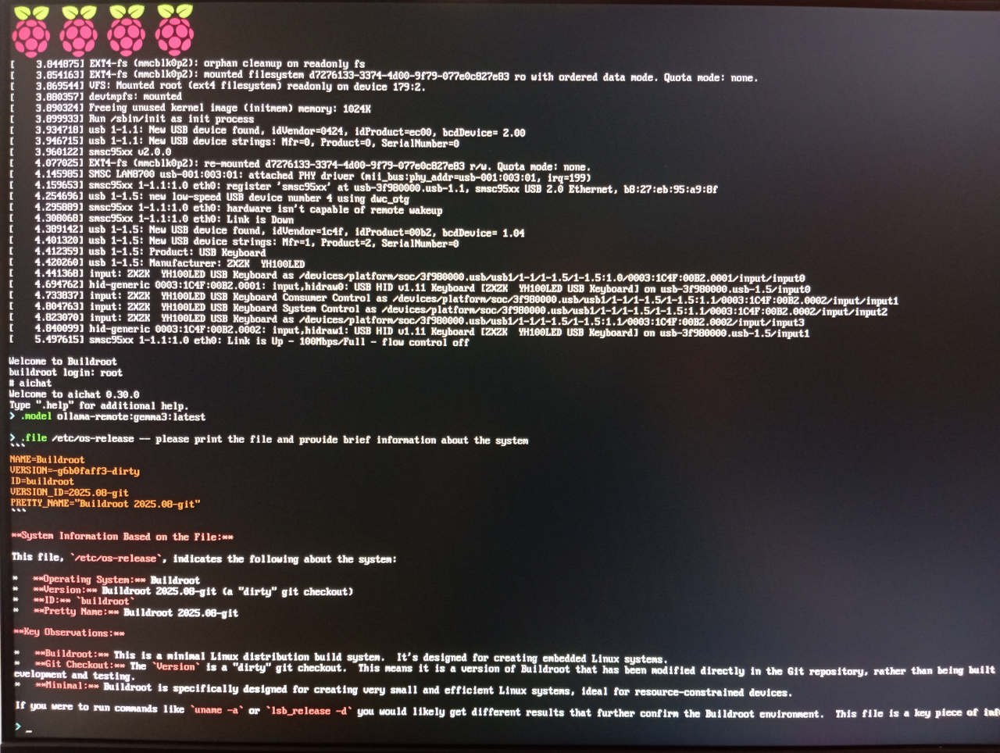

# About

[](https://gitlab.com/alexs-sh/aichat-buildroot/-/commits/master)
[](https://opensource.org/licenses/MIT)

A helper project to integrate [aichat](https://github.com/sigoden/aichat)
into [Buildroot](https://buildroot.org/). The patches submitted to the Buildroot team can be found
[here](https://patchwork.ozlabs.org/project/buildroot/list/?series=&submitter=&state=&q=aichat&archive=&delegate=)

# Status

AiChat works on the test platforms: Raspberry Pi 3 (ARM32), QEMU (AArch64), and
Orange Pi (AArch64).

However, I encountered crashes and rendering issues while working over a serial
port. This seems to be the exact problem I saw earlier in Helix, and it's likely
caused by the `crossterm` crate.

Here are related issues & PRs:
- [Crossterm](https://github.com/crossterm-rs/crossterm/pull/1007) - the main problem
- [AiChat](https://github.com/sigoden/aichat/pull/1366) - here you can find workarounds
- [Helix crash](https://github.com/helix-editor/helix/pull/14050) and [Helix render](https://github.com/helix-editor/helix/issues/14101)  - similar issues, but in Helix editor

I didn’t dig too deeply into the problem because:
- running AiChat over a serial line is a very unlikely scenario, and there’s a
simple workaround.
- serve/SSH/display modes work fine. In my opinion, this is the main use case(s).
- it’s very likely the same issue as with Helix. Let’s revisit it if the upstream
fixes don’t work for AiChat.

# Examples

**QEMU aarch64**



**Raspberry PI3**



# Build

The easiest way to build it is to use a script (like CI does).

```
git clone --recursive git@github.com:alexs-sh/aichat-buildroot.git
cd aichat-buildroot
./build-img.sh
```
Prepared images will be available at `buildroot/output/images` directory.

By default, the `build-img.sh` script builds a QEMU image. You can specify the
desired device by passing a configuration name to the script. For example,

```
./build-img.sh raspberrypi3_defconfig
```
Buildroot will generate images targeting the Raspberry Pi 3.

Please visit the `configs` directory to view the full list of supported platforms.

You can avoid using the script, as it only performs trivial operations such as
placing the modified configuration file in the correct location. Instead, you
can manually replace the configuration file and run Buildroot directly. For
example:

```
cp configs/qemu_aarch64_virt_defconfig buildroot/configs/qemu_aarch64_virt_defconfig
cd buildroot
make qemu_aarch64_virt_defconfig
make
```

If you need to add new packages or change the configuration, you can use the
default Buildroot tools located in the `buildroot` directory. For example:

```
cd buildroot
make menuconfig
```

Please note, Buildroot has its own requirements regarding the applications that
should be installed on the host system. For more details, refer to the [System requirements](https://buildroot.org/downloads/manual/manual.html#requirement)
section in the Buildroot documentation. Alternatively, you can check the
`dockerfiles` directory which contains instructions to prepare Debian-based
images used for CI builds.

